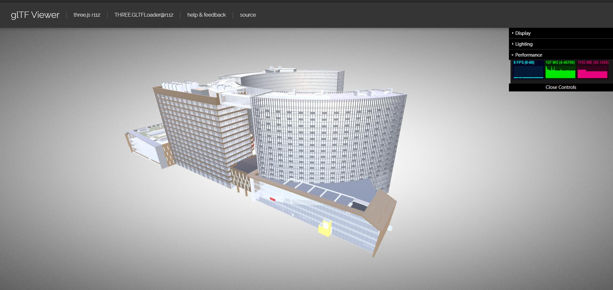
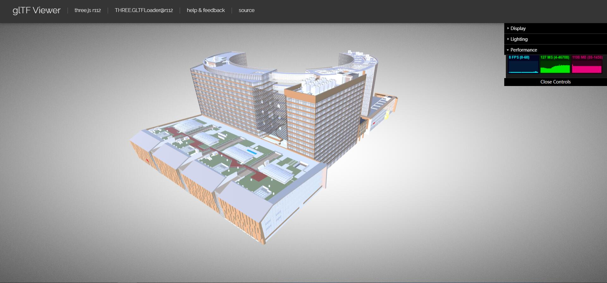
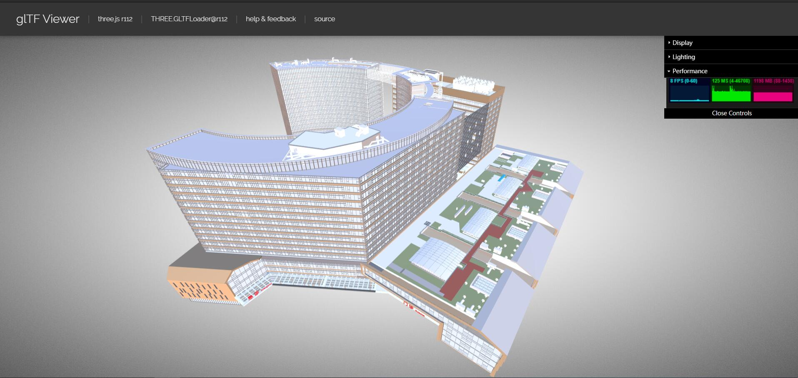
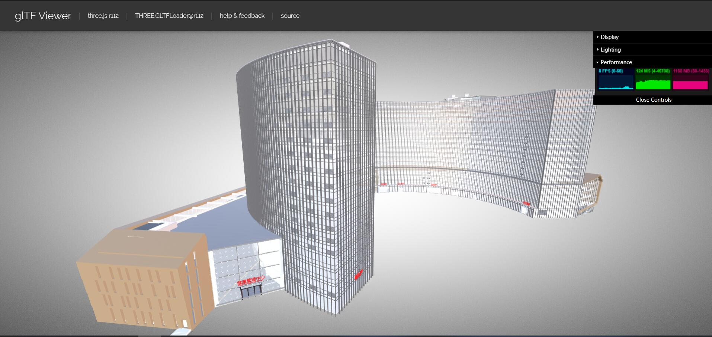

# RevitGLTF
* RevitGLTF - 导出插件，Revit导出GLTF
* MaterialAssetViewer - 工具插件，获取拾取构件的材质信息和ElementID
  
## 安装使用

### 开发环境
* Win10
* VS2019
* Revit2020
  
### 依赖库
* Revit SDK 2020
* GDImageLibrary
* log4net
* TargaImage
* TQ.Texture
* gltf-pipiline

### [gltf-pipeline](https://www.npmjs.com/package/gltf-pipeline)安装
* 安装[NodeJS](https://nodejs.org/en/)
* 命令行运行
```cmd
  npm install -g gltf-pipeline 
```

### 引用配置
  
* 添加引用目录<Revit安装目录>,添加RevitAPI.dll,RevitAPIUI.dll
* 添加引用目录RevitGLTF\Refs，添加缺失dll

### 日志配置
* 在RevitGLTF/revitGLTF.config文件中修改两处log输出目录
  
* 拷贝该文件至Revit安装目录(与Revit.exe同级)

### Revit插件位置
%appdata%\Autodesk\Revit\Addins\2020

### 调试技巧
* 修改项目属性-调试-启动外部程序
  
* 运行Revit后，“调试-附加到进程”，选择Revit.exe

## 开发计划
### 基础开发工作
- [x] 几何与材质导出
- [x] 几何顶点复用与渲染批次合并
- [x] Draco压缩与DXT纹理压缩
- [x] 模型外立面导出 LOD-0
- [x] 构件重用匹配算法 
- [ ] Mesh简化，多级LOD生成
- [ ] WebP纹理压缩
- [ ] 导出效率优化——导出mesh的重复顶点查找，去除不必要的UV坐标
- [ ] 对Revit不同版本的材质做进一步支撑
### GLTF导出
- [x] GLTF文件写出插件
- [x] GLTF Draco压缩
- [x] GLB 支持
### 3DTile导出
- [x] 3DTile序列化
- [x] RTree实现
- [ ] 构建索引树，支持3D Tile
- [ ] 实例属性数据

## 使用方法


## 现有进展
### Revit导出后数据下载链接
链接：https://pan.baidu.com/s/1NaIfVDzssUYw40XFJReDfQ
提取码：gpuo

### Revit样例数据


### 南京医院数据




