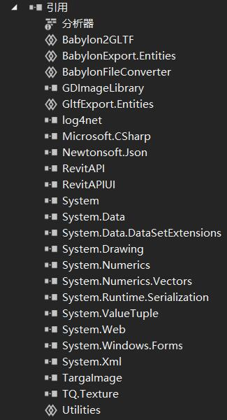
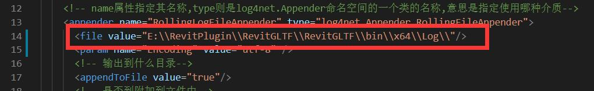
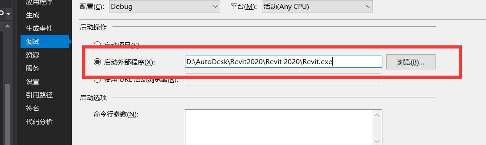
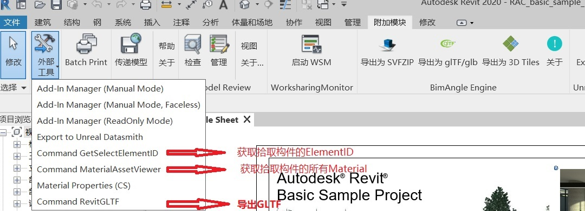
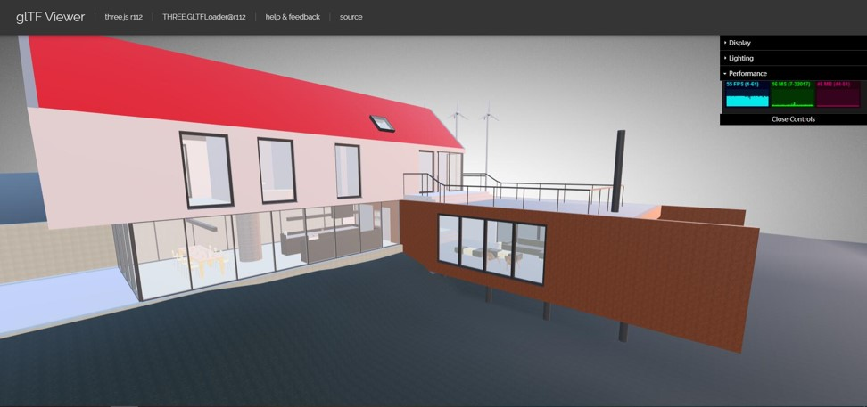
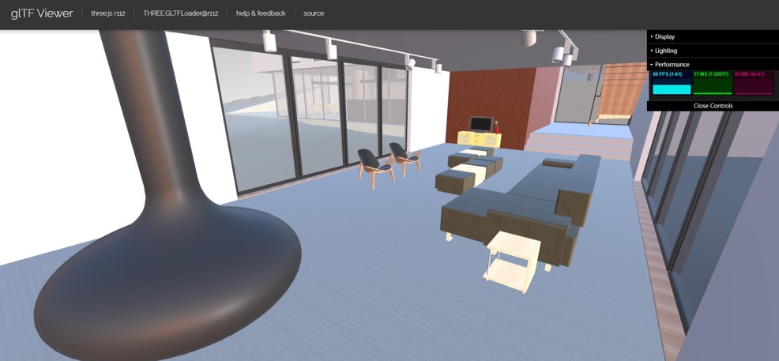

# RevitGLTF
* RevitGLTF - 导出插件，Revit导出GLTF
* MaterialAssetViewer - 工具插件，获取拾取构件的材质信息和ElementID
  
## 安装使用

### 开发环境
* Win10
* VS2019
  
### 依赖库
* Revit SDK 2020
* GDImageLibrary
* log4net
* TargaImage
* TQ.Texture

### 引用配置
  
* 添加引用目录<Revit安装目录>,添加RevitAPI.dll,RevitAPIUI.dll
* 添加引用目录RevitGLTF\Refs，添加缺失dll

### 日志配置
* 在RevitGLTF/revitGLTF.config文件中修改两处log输出目录
  
* 拷贝该文件至Revit安装目录(与Revit.exe同级)

### Revit插件位置
%appdata%\Autodesk\Revit\Addins\2020

### 调试技巧
* 修改项目属性-调试-启动外部程序
  
* 运行Revit后，“调试-附加到进程”，选择Revit.exe

## 开发计划
- [x] 几何与材质导出GLTF 
- [x] 几何顶点复用与渲染批次合并
- [x] Draco压缩与DXT纹理压缩
- [ ]模型外立面导出 LOD-0
- [ ]构件重用匹配算法 
- [ ]Mesh简化，多级LOD生成
- [ ]构建索引树
- [ ]WebP纹理压缩
- [ ]支持3D Tile
- [ ]多线程导出
- [ ]族实例属性数据库

## 使用方法

## 现有进展

